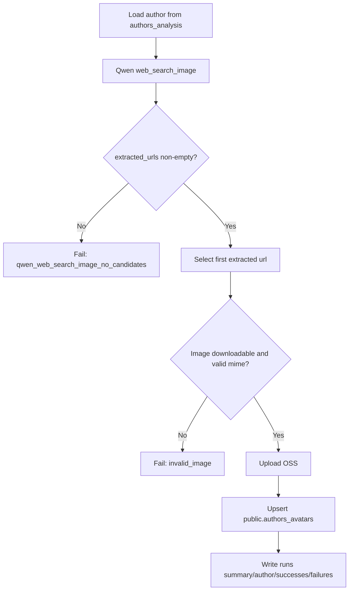

# OpenAlex Avatar Pipeline

这个项目现在只保留一条极简头像获取主流程：

`load author -> qwen web_search_image -> 提取 extracted_urls -> 默认取第1张 -> upload oss -> upsert public.authors_avatars -> write local run record`

## 当前架构

- 搜索与候选发现只使用 `qwen3.5-plus Responses API`
- Qwen 只使用 `web_search_image`
- `image_candidates` / `filtered_candidates` 来自 `web_search_image` 返回并本地去重
- 主链默认使用 `extracted_urls` 的第 1 张作为候选头像
- 保留 Qwen 输出 schema 校验，固定输出字段：
  - `profile_pages`
  - `image_candidates`
  - `filtered_candidates`
  - `failure_reason`
- 本地会做最小图片可用性校验（mime、可下载、尺寸可解析）
- 如果 `web_search_image` 没有返回可用 URL，则保守失败
- 数据库只使用：
  - 作者源数据读取
  - `public.authors_avatars` 查询
  - `public.authors_avatars` upsert
- 运行时审计数据全部写本地 `runs/`

## 判断逻辑流程图



## 目录

- `main.py`: 极简 CLI 入口
- `avatar_pipeline/qwen_tools.py`: Qwen `web_search_image` 调用与 URL 提取
- `avatar_pipeline/web_search_client.py`: 候选组装、去重、下载缓存、图片元数据读取
- `avatar_pipeline/pipeline_runner.py`: 线性主流程编排
- `avatar_pipeline/pg_repository.py`: 作者读取 + `authors_avatars` 查询/upsert
- `avatar_pipeline/local_run_store.py`: 本地运行日志落盘
- `review_runs.py`: 本地 runs 轻量审查工具
- `avatar_pipeline/oss_uploader.py`: OSS 上传

## 环境变量

数据库：

- `PGHOST`
- `PGPORT`
- `PGDATABASE`
- `PGUSER`
- `PGPASSWORD`
- `PGSSLMODE` 可选

OSS：

- `ALIYUN_OSS_ACCESS_KEY_ID`
- `ALIYUN_OSS_ACCESS_KEY_SECRET`
- `ALIYUN_OSS_BUCKET`
- `ALIYUN_OSS_ENDPOINT`
- `ALIYUN_OSS_PUBLIC_BASE_URL`
- `ALIYUN_OSS_KEY_PREFIX` 可选，默认 `openalex`
- `ALIYUN_OSS_CACHE_CONTROL` 可选

Qwen：

- `LLM_API_KEY`（或 `QWEN_API_KEY`）
- `LLM_BASE_URL`（或 `QWEN_BASE_URL`）
- `LLM_MODEL`（或 `QWEN_MODEL`）
- `QWEN_RESPONSE_PATH`，默认 `/responses`
- `QWEN_ENABLE_WEB_SEARCH`，默认 `true`（此处用于启用 `web_search_image` 工具调用）
- `QWEN_MAX_CANDIDATES`，默认 `8`
- `QWEN_MIN_CONFIDENCE`，默认 `0.55`
- `QWEN_TIMEOUT_SECONDS`，默认 `30`
- `QWEN_MIN_CALL_INTERVAL_SECONDS`，默认 `0`；设置后会在两次 Qwen `/responses` 调用之间强制休眠指定秒数

通用：

- `ALLOWED_MIME`，默认 `image/jpeg,image/png,image/webp`
- `MIN_IMAGE_EDGE_PX`，默认 `96`
- `REQUEST_TIMEOUT_SECONDS`，默认 `20`
- `MAX_RETRIES`，默认 `3`
- `GLOBAL_QPS_LIMIT`，默认 `2`

## 运行

处理指定作者：

```bash
python3 main.py --author-id A5038153411
```

批量处理：

```bash
python3 main.py --author-ids-file author_ids.json --workers 4
```

从 `authors_analysis` 扫描：

```bash
python3 main.py --author-limit 1000 --author-offset 0 --workers 4
```

断点续跑（resume）：

```bash
python3 main.py --author-limit 1000 --author-offset 0 --workers 4 --resume-run-id <run_id>
```

## 冒烟测试

环境变量准备：

- 数据库：`PGHOST`、`PGPORT`、`PGDATABASE`、`PGUSER`、`PGPASSWORD`
- OSS：`ALIYUN_OSS_ACCESS_KEY_ID`、`ALIYUN_OSS_ACCESS_KEY_SECRET`、`ALIYUN_OSS_BUCKET`、`ALIYUN_OSS_ENDPOINT`、`ALIYUN_OSS_PUBLIC_BASE_URL`
- Qwen：`QWEN_API_KEY`

单作者测试命令：

```bash
python3 main.py --author-id A5038153411 --workers 1 --progress-every 1 --log-level INFO
```

小批量测试命令：

```bash
python3 main.py --author-ids-file author_ids.json --workers 1 --progress-every 1 --log-level INFO
```

`author_ids.json` 示例：

```json
[
  {"author_id": "A5038153411"},
  {"author_id": "A5102019800"}
]
```

运行日志会按 author 打出关键步骤：

- `load_author`
- `qwen_search_image_start`
- `qwen_search_image_done`
- `select_first_extracted_url`
- `upload_oss_done`
- `upsert_authors_avatars_done`

成功时应该检查：

- `runs/<date>/<run_id>/summary.json`
- `runs/<date>/<run_id>/author_runs.jsonl`
- `public.authors_avatars` 中对应 author 的 upsert 结果
- 成功记录里的 `final_status=ok`
- 成功记录里的 `selected_candidate`、`oss_url`、`content_sha256`
- `selected_candidate.linked_profile_url` / `selected_candidate.linked_profile_domain`

失败时应该检查：

- `runs/<date>/<run_id>/failures.jsonl`
- 失败记录里的 `final_status`、`failure_reason`
- 如果是 Qwen 输出/结构化失败，重点看 `raw_content` 和 `response_text`
- 如果 `web_search_image` 无结果，通常会看到 `qwen_web_search_image_no_candidates`
- 如果是图片问题，重点看 `selected_candidate.invalid_reason`
- 终端日志里最后停留的 `pipeline_step`

## 单链路验证

验证“只剩 web_search_image”是否生效：

1. 运行单作者测试。
2. 在日志中确认出现 `qwen_web_search_image_started/qwen_web_search_image_finished`。
3. 检查 `author_runs.jsonl`：`image_candidates` / `filtered_candidates` 应直接来自 `web_search_image` 输出。
4. `selected_candidate.image_url` 应等于该作者 `filtered_candidates` 的第 1 条 URL。

## 本地运行日志

每次运行会生成：

```text
runs/<date>/<run_id>/
  summary.json
  planned_authors.jsonl
  author_runs.jsonl
  successes.jsonl
  failures.jsonl
```

失败样本会额外保留 `raw_content` / `response_text`，便于排查 Qwen 返回格式问题。

其中：

- `planned_authors.jsonl`：本次计划处理作者清单（用于审计“应处理集合”）
- `successes.jsonl`：拉取成功并完成入库的作者记录
- `failures.jsonl`：未拉取成功作者记录（可直接用于二次拉取）
- `author_runs.jsonl`：全量作者结果（成功+失败）

`summary.json` 会在运行中持续刷新，可实时查看：

- `source_total_authors`
- `scheduled_authors`
- `recorded_authors`
- `remaining_authors`
- `success_count`
- `failure_count`
- `stats`
- `run_status`（`running` / `finished`）

这套结构适合 systemd 长时间运行时做实时监控与中断恢复。

单个作者记录至少包含：

- `author_id`
- `display_name`
- `institution_name`
- `profile_pages`
- `image_candidates`
- `filtered_candidates`
- `selected_candidate`
- `final_status`
- `failure_reason`
- `oss_url`
- `content_sha256`
- `raw_content`
- `response_text`
- `timestamp`

## runs 审查工具

查看某个 run 的 summary：

```bash
python3 review_runs.py --run-id <run_id> --show-summary
```

按作者查询记录：

```bash
python3 review_runs.py --run-id <run_id> --author-id <author_id>
```

导出 failures 为 CSV：

```bash
python3 review_runs.py --run-id <run_id> --failures-csv failures.csv
```

## 数据库说明

唯一业务结果表：

- `public.authors_avatars`

运行时表：

- 不再读写 `openalex.avatar_pipeline_runs`
- 不再读写 `openalex.avatar_pipeline_author_runs`
- 不再读写 `openalex.avatar_candidate_images`
- 不再读写 `openalex.avatar_candidate_decisions`

删除这些表的建议 SQL 见 [migrations/20260310_drop_avatar_pipeline_runtime_tables.sql](/home/charlie/workspace/openalex/migrations/20260310_drop_avatar_pipeline_runtime_tables.sql)。

安全迁移顺序：

1. 先在新极简链路上跑一批作者，确认 `public.authors_avatars` 正常写入。
2. 检查 `runs/<date>/<run_id>/summary.json`、`author_runs.jsonl`、`failures.jsonl`，必要时用 `review_runs.py` 抽查失败样本里的 `raw_content` / `response_text`。
3. 确认本地 runs 审计已满足排查需要后，再人工执行 drop migration。
4. 不要在应用代码里自动执行删除 runtime tables 的 SQL。
