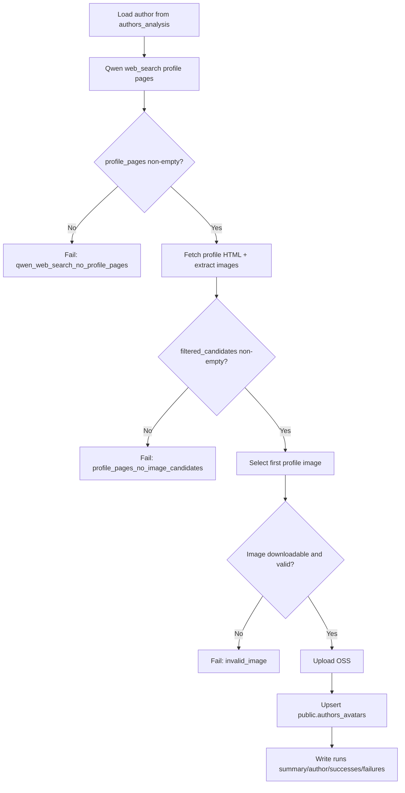

# OpenAlex Avatar Pipeline

当前主链路：

`load author -> qwen web_search 查找 profile pages -> 本地抓取 profile page HTML -> 抽取候选头像图片 -> 本地评分排序 -> 取第1张 -> upload oss -> upsert public.authors_avatars -> write local run record`

## 当前架构

- 搜索与候选发现使用 `qwen3.5-plus Responses API`
- Qwen 只用 `web_search` 找 `profile_pages`，不直接返回图片 URL
- profile page 发现优先依赖 `author.orcid`（无 ORCID 时保守失败）
- 候选图来自本地 HTML 抽取：
  - `meta[property="og:image"]`
  - `meta[name="twitter:image"]`
  - `img src`
  - `srcset`
- 本地打分后生成：
  - `image_candidates`（全量抽取候选）
  - `filtered_candidates`（排序+阈值后的候选）
- 主链默认使用 `filtered_candidates` 的第 1 张
- 保留 runs 审计字段：
  - `profile_pages`
  - `image_candidates`
  - `filtered_candidates`
  - `selected_candidate`
  - `raw_content`
  - `response_text`

## 判断逻辑流程图



## 目录

- `main.py`: CLI 入口
- `avatar_pipeline/qwen_tools.py`: Qwen `web_search` 调用与 `profile_pages` 提取
- `avatar_pipeline/profile_image_extractor.py`: profile page HTML 抽图与候选打分
- `avatar_pipeline/web_search_client.py`: profile page 抓取、候选聚合、排序、下载缓存、图片元数据读取
- `avatar_pipeline/pipeline_runner.py`: 线性主流程编排
- `avatar_pipeline/pg_repository.py`: 作者读取 + `authors_avatars` 查询/upsert
- `avatar_pipeline/local_run_store.py`: 本地运行日志落盘
- `avatar_pipeline/oss_uploader.py`: OSS 上传

## 环境变量

数据库：

- `PGHOST`
- `PGPORT`
- `PGDATABASE`
- `PGUSER`
- `PGPASSWORD`
- `PGSSLMODE` 可选

OSS：

- `ALIYUN_OSS_ACCESS_KEY_ID`
- `ALIYUN_OSS_ACCESS_KEY_SECRET`
- `ALIYUN_OSS_BUCKET`
- `ALIYUN_OSS_ENDPOINT`
- `ALIYUN_OSS_PUBLIC_BASE_URL`
- `ALIYUN_OSS_KEY_PREFIX` 可选，默认 `openalex`（用于 object key 前缀）
- `ALIYUN_OSS_CACHE_CONTROL` 可选

Qwen：

- `LLM_API_KEY`（或 `QWEN_API_KEY`）
- `LLM_BASE_URL`（或 `QWEN_BASE_URL`）
- `LLM_MODEL`（或 `QWEN_MODEL`）
- `QWEN_RESPONSE_PATH`，默认 `/responses`
- `QWEN_ENABLE_WEB_SEARCH`，默认 `true`（用于启用 `web_search` 工具调用）
- `QWEN_MAX_CANDIDATES`，默认 `3`
- `QWEN_MIN_CONFIDENCE`，默认 `0.55`
- `QWEN_MAX_OUTPUT_TOKENS`，默认 `256`
- `QWEN_TIMEOUT_SECONDS`，默认 `120`
- `QWEN_MIN_CALL_INTERVAL_SECONDS`，默认 `0`

Profile 抓取与抽图：

- `PROFILE_PAGE_FETCH_TIMEOUT_SECONDS`，默认复用 `REQUEST_TIMEOUT_SECONDS`
- `PROFILE_PAGE_MAX_COUNT`，默认 `5`
- `PROFILE_IMAGE_MAX_PER_PAGE`，默认 `10`
- `PROFILE_IMAGE_MIN_SCORE`，默认 `1.0`

通用：

- `ALLOWED_MIME`，默认 `image/jpeg,image/png,image/webp`
- `MIN_IMAGE_EDGE_PX`，默认 `96`（现已实际生效）
- `REQUEST_TIMEOUT_SECONDS`，默认 `20`
- `MAX_RETRIES`，默认 `3`
- `GLOBAL_QPS_LIMIT`，默认 `2`

## 运行

处理指定作者：

```bash
python3 main.py --author-id A5038153411
```

批量处理：

```bash
python3 main.py --author-ids-file author_ids.json --workers 4
```

从 `authors_analysis` 扫描：

```bash
python3 main.py --author-limit 1000 --author-offset 0 --workers 4
```

## 关键日志步骤

- `load_author`
- `qwen_search_profile_start`
- `qwen_search_profile_retry`
- `qwen_search_profile_done`
- `profile_search_empty`
- `select_first_profile_image`
- `upload_oss_done`
- `upsert_authors_avatars_done`

## 验证方法

单作者：

```bash
python3 main.py --author-id A5038153411 --workers 1 --progress-every 1 --log-level INFO
```

检查点：

1. 日志出现 `qwen_web_search_profile_started/qwen_web_search_profile_finished`。
2. `runs/<date>/<run_id>/author_runs.jsonl` 中有 `profile_pages`，且 `image_candidates` 来源为 profile page 抽取。
3. `selected_candidate.image_url` 等于 `filtered_candidates` 第 1 条。
4. `public.authors_avatars` 完成 upsert。

## Token 成本优化点

- LLM 只做 profile page 发现，不直接做图片候选筛选。
- 图片候选发现与排序全部在本地执行，显著减少模型输出长度和多轮推理成本。

## 本地运行日志

每次运行会生成：

```text
runs/<date>/<run_id>/
  summary.json
  planned_authors.jsonl
  author_runs.jsonl
  successes.jsonl
  failures.jsonl
```

失败样本保留 `raw_content` / `response_text` 便于排查 Qwen 输出问题。
